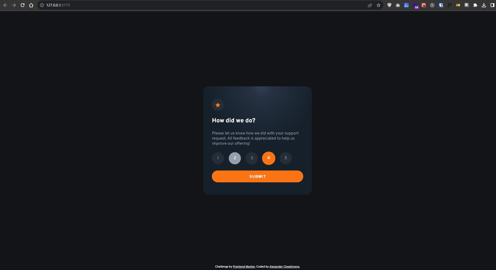

# Interactive rating component

This is a solution to the [Interactive rating component challenge on Frontend Mentor](https://www.frontendmentor.io/challenges/interactive-rating-component-koxpeBUmI). Frontend Mentor challenges help you improve your coding skills by building realistic projects.

## Table of contents

- [Overview](#overview)
  - [The challenge](#the-challenge)
  - [Screenshot](#screenshot)
  - [Links](#links)
- [My process](#my-process)
  - [Built with](#built-with)
  - [What I learned](#what-i-learned)
  - [Continued development](#continued-development)
  - [Useful resources](#useful-resources)
- [Author](#author)
- [Acknowledgments](#acknowledgments)

## Overview

### The challenge

Users should be able to:

- View the optimal layout for the app depending on their device's screen size
- See hover states for all interactive elements on the page
- Select and submit a number rating
- See the "Thank you" card state after submitting a rating

### Screenshot

### Links

- Solution URL: [Solution URL](https://your-solution-url.com)
- Live Site URL: [Live site URL](https://xanderyeng.github.io/Interactive-rating-component/)

## My process

### Built with

- Semantic HTML5 markup
- CSS custom properties
- Flexbox
- CSS Grid
- Mobile-first workflow
- [React](https://reactjs.org/) - JS library
- [Framer Motion](https://www.framer.com/motion/) - Animation library

### What I learned

Throughout this project, I gained experience in building interactive components using React and enhancing user experience with animations. I also learned how to structure my components for reusability and maintainability.

Learning how to deploy a React project to GitHub pages when scaffolded with vite was very refreshing. Creating a yaml file which would define the sequence of creating the artifacts required to build and deploy the final project files for hosting.

### Continued development

In future projects, I plan to explore more advanced animation techniques and focus on optimizing performance. I'm also excited to further develop my skills in responsive design and UI/UX principles.

### Useful resources

- [Framer Motion Documentation](https://www.framer.com/docs/)
- [React Icons Documentation](https://react-icons.github.io/react-icons/)
- [Frontend Mentor Community](https://www.frontendmentor.io/community)

## Author

- Website: [https://chepkiyeng.tech](https://chepkiyeng.tech)
- Frontend Mentor - [@Xanderyeng](https://www.frontendmentor.io/profile/Xanderyeng)
- LinkedIn - [@alex-chepkiyeng](https://www.linkedin.com/in/alex-chepkiyeng-30626172/)

## Acknowledgments

I'd like to express my gratitude to the Frontend Mentor community for providing this challenge and supporting my learning journey. Additionally, I'm thankful for the valuable resources that have helped me improve my coding skills.
